```python
import pytimber
import time
import matplotlib.pyplot as plt
import numpy as np
import pandas as pd

year="2017"

doProduceNewFiles = False
```


```python
# The online operational data of the Large Hadron Collider (LHC) are stored in a Logging Database
# This databased can be accessed through the timber interface, or through its python version pytimber
# https://github.com/rdemaria/pytimber
# This notebook shows an example of a systematic retreival of beam intensity quantities in each 2017 run of the LHC
# The goal is to calculate the total number of protons per beam that are lost in collimators and/or absorbers of the accelerator while the accelerator is operating at top energy (6.5 TeV)

# Note: each LHC run consists of a sequence of beam modes. 
# Below: list of beam mode codes as logged in the "HX:BMODE" timber variable
#setup 2
#injection probe beam 3
#injection setup beam 4
#injection physics beam 5
#prepare ramp 6
#ramp 7
#flat top 8
#squeeze 9
#adjust 10
#stable beams 11
#unstable beams 12
#beam dump 13
#ramp down 14
#recovery 15
#inject and dump 16
#circulate and dump 17
#abort 18
#cycling 19
#beam dump warning 20
#no beam 21
#prepare injection 22
```


```python
# initialize LDB with pytimber
ldb = pytimber.LoggingDB()
```


```python
var_mode = "HX:BMODE"

# '2018-08-06 07:00:00','2018-08-07 06:01:00' : good proton run

def scanPeriod(start, end):

    # Retrieve beam mode information from pytimber for the desired period
    # pytimber data structure: dictionary with timestamp and value vectors
    d_beammodes=ldb.get([var_mode], start,end)
    t_beammodes,v_beammodes=d_beammodes[var_mode]

    # Retrieve list of fills where the 'stable beam' operation is reached
    fills = ldb.getLHCFillsByTime(start, end, beam_modes='STABLE') 
    
    #print (f for f in fills)
    print (fills[0])
    fillnumbers = []
    fillsize=dict()
    starttimes = dict()
    endtimes = dict()
    for i in range(0,len(fills)) :
        fillnum = fills[i]['fillNumber']
        fillnumbers.append(fillnum)
        beammodes = fills[i]['beamModes']
        #print (len(beammodes))
        jflattop = 0
        jstable = 0
        foundFlatTop = False
        foundStable = False
        fillsize[fillnum]=0
        starttimes[fillnum]=[]
        endtimes[fillnum]=[]
        for j in range (0,len(beammodes)) :
            if jflattop==0 and beammodes[j]['mode']=='FLATTOP' and foundFlatTop==False and foundStable==False:
                startflattop = beammodes[j]['startTime']
                #starttimes[fillnum].append(beammodes[j]['startTime'])
                jflattop = j
                foundFlatTop = True
            if j>jflattop and beammodes[j]['mode']=='FLATTOP' and foundFlatTop==True and foundStable==False : #two flat tops before stable beams
                startflattop = beammodes[j]['startTime']
                jflattop = j
            if j>jflattop and beammodes[j]['mode']=='STABLE' and foundFlatTop==True and foundStable==False : #standard situation: stable beams after ramp
                starttimes[fillnum].append(startflattop)
                endtimes[fillnum].append(beammodes[j]['endTime'])
                fillsize[fillnum]+=1
                jstable = j
                foundStable = True
                foundFlatTop = False
            if j>jstable and beammodes[j]['mode']=='STABLE' and foundStable==True : #more than 1 stable beams after ramp. happens if something spoils the stable beam mode in the middle of a fill.
                starttimes[fillnum].append(beammodes[j]['startTime'])
                endtimes[fillnum].append(beammodes[j]['endTime'])
                fillsize[fillnum]+=1
                jstable = j


    # consider only the periods of time from the beginning of the 'flat top' beam mode to the end of 'stable beam' within each fill
    return (fillnumbers, fillsize , starttimes , endtimes)
    

```


```python
# consider the period from may to mid-November 2017
mstart = '2017-05-01 00:00:00'
mend = '2017-11-11 00:00:00'

if doProduceNewFiles == True :
    vec_fillnumbers, dict_fillsize, dict_tstart, dict_tend = scanPeriod(mstart,mend)
    #print (vec_fillnumbers)
    #print ("tstart: " , dict_tstart)
    #print ("tend: " , dict_tend)
    #print ("fillsize: " , dict_fillsize)
    print ("lengths: " , len(vec_fillnumbers),len(dict_fillsize),len(dict_tstart),len(dict_tend))
```


```python
int_b1 = 'LHC.BCTDC.A6R4.B1:BEAM_INTENSITY' # beam 1 intensity
int_b2 = 'LHC.BCTDC.A6R4.B2:BEAM_INTENSITY' # beam 2 intensity

def show_intensity(fillnumbers, fillsize, tstartvec, tendvec):
    
    if len(tstartvec)!=len(tendvec) :
        print('Wrong length of inputs! Exiting')
        return
    
    d_int_b1 = dict()
    t_int_b1 = dict()
    v_int_b1 = dict()
    d_int_b2 = dict()
    t_int_b2 = dict()
    v_int_b2 = dict()
    fig=dict()
    ax=dict()
    counter = 0
    
    for fill in fillnumbers :
        
        fsize = fillsize[fill]
        d_int_b1[fill] = dict()
        t_int_b1[fill] = dict()
        v_int_b1[fill] = dict()
        d_int_b2[fill] = dict()
        t_int_b2[fill] = dict()
        v_int_b2[fill] = dict()
     
        for i in range(0,fsize) :
            if tendvec[fill][i]-tstartvec[fill][i] < 100 :
                continue
            d_int_b1[fill][i]=ldb.get([int_b1], tstartvec[fill][i],tendvec[fill][i])
            t_int_b1[fill][i],v_int_b1[fill][i]=d_int_b1[fill][i][int_b1]
            d_int_b2[fill][i]=ldb.get([int_b2], tstartvec[fill][i],tendvec[fill][i])
            t_int_b2[fill][i],v_int_b2[fill][i]=d_int_b2[fill][i][int_b2]
        counter+=1
        print ("Done fill " , counter , " of " , len(tstartvec))
        
    return t_int_b1 , v_int_b1 , t_int_b2 , v_int_b2


```


```python
if doProduceNewFiles == True :
    tt_int_b1 , vv_int_b1 , tt_int_b2 , vv_int_b2 = show_intensity(vec_fillnumbers, dict_fillsize, dict_tstart, dict_tend)
```


```python
# since retrieving all data from pytimber takes some time, it is convenient to store the dictionaries in files to be able to re-open them quickly


import pickle

if doProduceNewFiles==True :

    with open('vec_fillnumbers_'+year+'.txt', 'wb') as handle:
        pickle.dump(vec_fillnumbers, handle)
    with open('dict_fillsize_'+year+'.txt', 'wb') as handle:
        pickle.dump(dict_fillsize, handle)
    with open('dict_tstart_'+year+'.txt', 'wb') as handle:
        pickle.dump(dict_tstart, handle)
    with open('dict_tend_'+year+'.txt', 'wb') as handle:
        pickle.dump(dict_tend, handle)        
    with open('t_int_b1_'+year+'.txt', 'wb') as handle:
        pickle.dump(tt_int_b1, handle)
    with open('v_int_b1_'+year+'.txt', 'wb') as handle:
        pickle.dump(vv_int_b1, handle)
    with open('t_int_b2_'+year+'.txt', 'wb') as handle:
        pickle.dump(tt_int_b2, handle)
    with open('v_int_b2_'+year+'.txt', 'wb') as handle:
        pickle.dump(vv_int_b2, handle)

        
else :
    
    with open('vec_fillnumbers_'+year+'.txt', 'rb') as handle:
        vec_fillnumbers = pickle.load(handle)
    with open('dict_fillsize_'+year+'.txt', 'rb') as handle:
        dict_fillsize = pickle.load(handle)
    with open('dict_tstart_'+year+'.txt', 'rb') as handle:
        dict_tstart = pickle.load(handle)
    with open('dict_tend_'+year+'.txt', 'rb') as handle:
        dict_tend = pickle.load(handle)        
    with open('t_int_b1_'+year+'.txt', 'rb') as handle:
        tt_int_b1 = pickle.load(handle)
    with open('v_int_b1_'+year+'.txt', 'rb') as handle:
        vv_int_b1 = pickle.load(handle)
    with open('t_int_b2_'+year+'.txt', 'rb') as handle:
        tt_int_b2 = pickle.load(handle)
    with open('v_int_b2_'+year+'.txt', 'rb') as handle:
        vv_int_b2 = pickle.load(handle)

```


```python
# plot the beam 1 and beam 2 intensities in each period under exam
# find the timestamp when the LHC beams are extracted (corresponding to a sharp drop in beam intensity)
# calculate the number of lost protons in each fill in beam 1 and beam 2, and sum them over all fills

def plotFills (vec_fillnumbers, dict_fillsize, dict_tstart, dict_tend,t_int_b1,v_int_b1,t_int_b2,v_int_b2) :

    fig=dict()
    ax=dict()
    
    initialprotons_b1 = 0.
    initialprotons_b2 = 0.

    lostprotons_b1 = 0.
    lostprotons_b2 = 0.
    
    dumpedprotons_b1 = 0.
    dumpedprotons_b2 = 0.

    for fill in vec_fillnumbers :
        
        fig[fill]=dict()
        ax[fill]=dict()
        #print ("Fill: " , dict_fillsize[fill])
        
        for i in range(0,dict_fillsize[fill]):
        
            if dict_tend[fill][i]-dict_tstart[fill][i] < 100 :
                print ("Fill " , fill , "length : ", dict_tend[fill][i]-dict_tstart[fill][i] , " is < 100 - continuing")
                continue

            max_b1 = max(v_int_b1[fill][i])
            max_b2 = max(v_int_b2[fill][i])
        
            if max_b1 < 1e12 or max_b2 < 1e12 :
                print ("Fill " , fill , "max intensities : b1 ", '{:0.3e}'.format(max_b1) , " b2 " , '{:0.3e}'.format(max_b2)  , " < 1e12 - continuing")
                continue
    
            dumped_b1 = 0.
            dumped_b2 = 0.
        
            for j in reversed(range(0,len(v_int_b1[fill][i]))) :
                #print (j)
                if v_int_b1[fill][i][j] > 1e12 and j>4 and (1-v_int_b1[fill][i][j]/v_int_b1[fill][i][j-1]) < 0.01 :
                    dumped_b1 = v_int_b1[fill][i][j-5]
                    break

            for j in reversed(range(0,len(v_int_b2[fill][i]))) :
                if v_int_b2[fill][i][j] > 1e12 and j>4 and (1-v_int_b2[fill][i][j]/v_int_b2[fill][i][j-1]) < 0.01 :
                    dumped_b2 = v_int_b2[fill][i][j-5]
                    break
        
        
            print ("Fill ", fill , " entry " ,i+1)
            print ("B1: max" , '{:0.3e}'.format(max_b1) , " dumped" , '{:0.3e}'.format(dumped_b1) )
            print ("B2: max" , '{:0.3e}'.format(max_b2) , " dumped" , '{:0.3e}'.format(dumped_b2) )
            print (" ")
        
            initialprotons_b1 += max_b1
            initialprotons_b2 += max_b2

            dumpedprotons_b1 += dumped_b1
            dumpedprotons_b2 += dumped_b2

            lostprotons_b1 += max_b1-dumped_b1
            lostprotons_b2 += max_b2-dumped_b2

            
            fig[fill][i] = plt.figure(facecolor = 'white',figsize=(6.4,4.8))
            ax[fill][i] = fig[fill][i].add_subplot(1,1,1)
        
            ax[fill][i].plot(t_int_b1[fill][i],v_int_b1[fill][i], color = 'red', label = 'Beam 1 intensity', ls = '-', marker = '', lw = 2, mec = 'gray')
            ax[fill][i].plot(t_int_b2[fill][i],v_int_b2[fill][i], color = 'blue', label = 'Beam 2 intensity', ls = '-', marker = '', lw = 2, mec = 'gray')

            ax[fill][i].axhline(y=max_b1,color='lightcoral',linestyle='--')
            ax[fill][i].axhline(y=dumped_b1,color='lightcoral',linestyle='--')

            ax[fill][i].axhline(y=max_b2,color='royalblue',linestyle='--')
            ax[fill][i].axhline(y=dumped_b2,color='royalblue',linestyle='--')
        
            ax[fill][i].set_ylabel('Intensity', fontsize = 12)
            ax[fill][i].set_xlabel('Time', fontsize = 12)
            mtitle = 'Fill number '+str(fill)
            if i>0 :
                mtitle+=" part "+str(i+1)
            ax[fill][i].set_title(mtitle)

            ax[fill][i].legend(loc=(0.01, 0.84), prop = {'size':12}, numpoints = 1)
            pytimber.set_xaxis_date()
        
    print ("Total initial protons B1: " , '{:0.3e}'.format(initialprotons_b1))
    print ("Total initial protons B2: " , '{:0.3e}'.format(initialprotons_b2))

    print ("Total dumped protons B1: " , '{:0.3e}'.format(dumpedprotons_b1))
    print ("Total dumped protons B2: " , '{:0.3e}'.format(dumpedprotons_b2))
    
    print ("Total lost protons B1: " , '{:0.3e}'.format(lostprotons_b1))
    print ("Total lost protons B2: " , '{:0.3e}'.format(lostprotons_b2))

    return lostprotons_b1 , lostprotons_b2

```


```python
lost_b1 , lost_b2 = plotFills (vec_fillnumbers, dict_fillsize, dict_tstart, dict_tend,tt_int_b1,vv_int_b1,tt_int_b2,vv_int_b2) 


```

    Fill  5698 max intensities : b1  2.916e+11  b2  3.222e+11  < 1e12 - continuing
    Fill  5699 max intensities : b1  3.024e+11  b2  3.374e+11  < 1e12 - continuing
    Fill  5704  entry  1
    B1: max 1.318e+12  dumped 1.123e+12
    B2: max 1.368e+12  dumped 1.166e+12
     
    Fill  5710  entry  1
    B1: max 1.266e+12  dumped 1.170e+12
    B2: max 1.319e+12  dumped 1.077e+12
     
    Fill  5717  entry  1
    B1: max 9.030e+12  dumped 7.726e+12
    B2: max 8.922e+12  dumped 7.655e+12
     
    Fill  5718  entry  1
    B1: max 8.450e+12  dumped 7.258e+12
    B2: max 8.398e+12  dumped 7.252e+12
     
    Fill  5719  entry  1
    B1: max 8.432e+12  dumped 7.760e+12
    B2: max 8.601e+12  dumped 7.972e+12
     
    Fill  5722  entry  1
    B1: max 3.931e+13  dumped 3.102e+13
    B2: max 3.915e+13  dumped 3.146e+13
     
    Fill  5730  entry  1
    B1: max 3.444e+13  dumped 2.666e+13
    B2: max 3.433e+13  dumped 2.645e+13
     
    Fill  5730  entry  2
    B1: max 2.644e+13  dumped 2.360e+13
    B2: max 2.624e+13  dumped 2.346e+13
     
    Fill  5737  entry  1
    B1: max 3.350e+13  dumped 2.940e+13
    B2: max 3.345e+13  dumped 2.971e+13
     
    Fill  5746  entry  1
    B1: max 6.342e+13  dumped 4.658e+13
    B2: max 6.368e+13  dumped 4.753e+13
     
    Fill  5749  entry  1
    B1: max 6.288e+13  dumped 6.182e+13
    B2: max 6.369e+13  dumped 6.229e+13
     
    Fill  5750  entry  1
    B1: max 6.249e+13  dumped 5.304e+13
    B2: max 6.344e+13  dumped 5.417e+13
     
    Fill  5822 max intensities : b1  7.614e+11  b2  7.425e+11  < 1e12 - continuing
    Fill  5824  entry  1
    B1: max 7.312e+13  dumped 6.586e+13
    B2: max 7.315e+13  dumped 6.617e+13
     
    Fill  5824  entry  2
    B1: max 6.566e+13  dumped 6.378e+13
    B2: max 6.596e+13  dumped 6.419e+13
     
    Fill  5825  entry  1
    B1: max 1.214e+14  dumped 1.172e+14
    B2: max 1.213e+14  dumped 1.178e+14
     
    Fill  5830  entry  1
    B1: max 1.122e+14  dumped 1.011e+14
    B2: max 1.119e+14  dumped 1.021e+14
     
    Fill  5830  entry  2
    B1: max 1.008e+14  dumped 9.483e+13
    B2: max 1.018e+14  dumped 9.633e+13
     
    Fill  5830  entry  3
    B1: max 9.456e+13  dumped 8.790e+13
    B2: max 9.610e+13  dumped 9.001e+13
     
    Fill  5830  entry  4
    B1: max 8.771e+13  dumped 8.532e+13
    B2: max 8.983e+13  dumped 8.759e+13
     
    Fill  5833  entry  1
    B1: max 1.082e+14  dumped 9.473e+13
    B2: max 1.090e+14  dumped 9.673e+13
     
    Fill  5834  entry  1
    B1: max 1.089e+14  dumped 8.713e+13
    B2: max 1.092e+14  dumped 8.905e+13
     


    /cvmfs/sft.cern.ch/lcg/views/LCG_94python3/x86_64-centos7-gcc7-opt/lib/python3.6/site-packages/matplotlib/pyplot.py:537: RuntimeWarning: More than 20 figures have been opened. Figures created through the pyplot interface (`matplotlib.pyplot.figure`) are retained until explicitly closed and may consume too much memory. (To control this warning, see the rcParam `figure.max_open_warning`).
      max_open_warning, RuntimeWarning)


    Fill  5837  entry  1
    B1: max 1.355e+14  dumped 9.535e+13
    B2: max 1.360e+14  dumped 9.671e+13
     
    Fill  5838  entry  1
    B1: max 1.336e+14  dumped 1.199e+14
    B2: max 1.349e+14  dumped 1.217e+14
     
    Fill  5839  entry  1
    B1: max 1.409e+14  dumped 1.147e+14
    B2: max 1.425e+14  dumped 1.173e+14
     
    Fill  5840  entry  1
    B1: max 1.418e+14  dumped 1.122e+14
    B2: max 1.426e+14  dumped 1.152e+14
     
    Fill  5842  entry  1
    B1: max 1.809e+14  dumped 1.327e+14
    B2: max 1.826e+14  dumped 1.370e+14
     
    Fill  5845  entry  1
    B1: max 2.022e+14  dumped 1.812e+14
    B2: max 2.052e+14  dumped 1.859e+14
     
    Fill  5848  entry  1
    B1: max 2.002e+14  dumped 1.249e+14
    B2: max 2.018e+14  dumped 1.292e+14
     
    Fill  5849  entry  1
    B1: max 2.312e+14  dumped 1.244e+14
    B2: max 2.344e+14  dumped 1.346e+14
     
    Fill  5856  entry  1
    B1: max 2.585e+14  dumped 1.701e+14
    B2: max 2.609e+14  dumped 1.853e+14
     
    Fill  5862  entry  1
    B1: max 2.620e+14  dumped 2.496e+14
    B2: max 2.659e+14  dumped 2.545e+14
     
    Fill  5864  entry  1
    B1: max 2.441e+14  dumped 2.015e+14
    B2: max 2.448e+14  dumped 2.054e+14
     
    Fill  5865  entry  1
    B1: max 2.597e+14  dumped 1.896e+14
    B2: max 2.637e+14  dumped 2.011e+14
     
    Fill  5868  entry  1
    B1: max 2.807e+14  dumped 2.609e+14
    B2: max 2.823e+14  dumped 2.660e+14
     
    Fill  5870  entry  1
    B1: max 2.758e+14  dumped 2.713e+14
    B2: max 2.802e+14  dumped 2.771e+14
     
    Fill  5872  entry  1
    B1: max 2.626e+14  dumped 1.644e+14
    B2: max 2.648e+14  dumped 1.765e+14
     
    Fill  5873  entry  1
    B1: max 2.682e+14  dumped 1.914e+14
    B2: max 2.720e+14  dumped 2.024e+14
     
    Fill  5876  entry  1
    B1: max 2.680e+14  dumped 1.877e+14
    B2: max 2.699e+14  dumped 1.972e+14
     
    Fill  5878  entry  1
    B1: max 2.669e+14  dumped 1.855e+14
    B2: max 2.678e+14  dumped 1.899e+14
     
    Fill  5880  entry  1
    B1: max 2.769e+14  dumped 2.596e+14
    B2: max 2.780e+14  dumped 2.625e+14
     
    Fill  5882  entry  1
    B1: max 2.841e+14  dumped 2.062e+14
    B2: max 2.859e+14  dumped 2.175e+14
     
    Fill  5883  entry  1
    B1: max 2.846e+14  dumped 2.336e+14
    B2: max 2.890e+14  dumped 2.446e+14
     
    Fill  5885  entry  1
    B1: max 2.767e+14  dumped 2.707e+14
    B2: max 2.848e+14  dumped 2.812e+14
     
    Fill  5887  entry  1
    B1: max 2.922e+14  dumped 2.529e+14
    B2: max 2.981e+14  dumped 2.640e+14
     
    Fill  5919 max intensities : b1  1.454e+11  b2  1.463e+11  < 1e12 - continuing
    Fill  5920 max intensities : b1  1.644e+11  b2  1.457e+11  < 1e12 - continuing
    Fill  5930  entry  1
    B1: max 6.039e+12  dumped 5.579e+12
    B2: max 6.077e+12  dumped 5.675e+12
     
    Fill  5934  entry  1
    B1: max 6.824e+13  dumped 6.239e+13
    B2: max 6.844e+13  dumped 6.392e+13
     
    Fill  5942  entry  1
    B1: max 1.488e+14  dumped 1.367e+14
    B2: max 1.499e+14  dumped 1.404e+14
     
    Fill  5946  entry  1
    B1: max 1.503e+14  dumped 1.483e+14
    B2: max 1.519e+14  dumped 1.508e+14
     
    Fill  5950  entry  1
    B1: max 2.397e+14  dumped 1.721e+14
    B2: max 2.431e+14  dumped 1.838e+14
     
    Fill  5952  entry  1
    B1: max 2.551e+14  dumped 2.413e+14
    B2: max 2.586e+14  dumped 2.482e+14
     
    Fill  5954  entry  1
    B1: max 2.589e+14  dumped 2.329e+14
    B2: max 2.634e+14  dumped 2.423e+14
     
    Fill  5958  entry  1
    B1: max 2.556e+14  dumped 2.093e+14
    B2: max 2.594e+14  dumped 2.200e+14
     
    Fill  5960  entry  1
    B1: max 2.573e+14  dumped 2.198e+14
    B2: max 2.603e+14  dumped 2.290e+14
     
    Fill  5962  entry  1
    B1: max 2.814e+14  dumped 2.133e+14
    B2: max 2.855e+14  dumped 2.271e+14
     
    Fill  5963  entry  1
    B1: max 2.829e+14  dumped 2.642e+14
    B2: max 2.881e+14  dumped 2.732e+14
     
    Fill  5965  entry  1
    B1: max 2.903e+14  dumped 2.699e+14
    B2: max 2.952e+14  dumped 2.777e+14
     
    Fill  5966  entry  1
    B1: max 2.827e+14  dumped 2.765e+14
    B2: max 2.899e+14  dumped 2.861e+14
     
    Fill  5971  entry  1
    B1: max 3.032e+14  dumped 2.909e+14
    B2: max 3.074e+14  dumped 2.977e+14
     
    Fill  5974  entry  1
    B1: max 2.646e+14  dumped 2.593e+14
    B2: max 2.657e+14  dumped 2.618e+14
     
    Fill  5976  entry  1
    B1: max 2.825e+14  dumped 1.771e+14
    B2: max 2.854e+14  dumped 1.921e+14
     
    Fill  5979  entry  1
    B1: max 2.813e+14  dumped 1.856e+14
    B2: max 2.848e+14  dumped 2.002e+14
     
    Fill  5980  entry  1
    B1: max 1.382e+14  dumped 1.132e+14
    B2: max 1.379e+14  dumped 1.147e+14
     
    Fill  5984  entry  1
    B1: max 3.028e+14  dumped 2.789e+14
    B2: max 3.050e+14  dumped 2.844e+14
     
    Fill  6012  entry  1
    B1: max 4.863e+12  dumped 4.587e+12
    B2: max 4.758e+12  dumped 4.652e+12
     
    Fill  6015  entry  1
    B1: max 4.564e+12  dumped 4.559e+12
    B2: max 4.586e+12  dumped 4.581e+12
     
    Fill  6016  entry  1
    B1: max 4.560e+12  dumped 4.384e+12
    B2: max 4.576e+12  dumped 4.455e+12
     
    Fill  6018  entry  1
    B1: max 6.976e+13  dumped 6.862e+13
    B2: max 7.046e+13  dumped 6.978e+13
     
    Fill  6019  entry  1
    B1: max 6.691e+13  dumped 6.328e+13
    B2: max 6.746e+13  dumped 6.487e+13
     
    Fill  6020  entry  1
    B1: max 2.872e+14  dumped 2.741e+14
    B2: max 2.915e+14  dumped 2.814e+14
     
    Fill  6021  entry  1
    B1: max 2.859e+14  dumped 2.804e+14
    B2: max 2.911e+14  dumped 2.881e+14
     
    Fill  6024  entry  1
    B1: max 2.840e+14  dumped 1.706e+14
    B2: max 2.887e+14  dumped 1.850e+14
     
    Fill  6026  entry  1
    B1: max 2.828e+14  dumped 1.740e+14
    B2: max 2.899e+14  dumped 1.991e+14
     
    Fill  6030  entry  1
    B1: max 2.937e+14  dumped 2.666e+14
    B2: max 2.981e+14  dumped 2.755e+14
     
    Fill  6031  entry  1
    B1: max 2.932e+14  dumped 1.689e+14
    B2: max 2.977e+14  dumped 2.072e+14
     
    Fill  6035  entry  1
    B1: max 2.914e+14  dumped 2.043e+14
    B2: max 2.963e+14  dumped 2.225e+14
     
    Fill  6041  entry  1
    B1: max 2.821e+14  dumped 2.572e+14
    B2: max 2.879e+14  dumped 2.681e+14
     
    Fill  6044  entry  1
    B1: max 2.936e+14  dumped 1.983e+14
    B2: max 2.967e+14  dumped 2.125e+14
     
    Fill  6046  entry  1
    B1: max 2.906e+14  dumped 1.836e+14
    B2: max 2.937e+14  dumped 1.971e+14
     
    Fill  6048  entry  1
    B1: max 2.947e+14  dumped 2.785e+14
    B2: max 2.996e+14  dumped 2.869e+14
     
    Fill  6050  entry  1
    B1: max 2.943e+14  dumped 1.829e+14
    B2: max 2.983e+14  dumped 2.021e+14
     
    Fill  6052  entry  1
    B1: max 2.900e+14  dumped 1.834e+14
    B2: max 2.962e+14  dumped 2.062e+14
     
    Fill  6053  entry  1
    B1: max 2.921e+14  dumped 2.083e+14
    B2: max 2.960e+14  dumped 2.297e+14
     
    Fill  6054  entry  1
    B1: max 2.920e+14  dumped 1.724e+14
    B2: max 3.016e+14  dumped 2.040e+14
     
    Fill  6055  entry  1
    B1: max 2.883e+14  dumped 2.724e+14
    B2: max 2.947e+14  dumped 2.848e+14
     
    Fill  6057  entry  1
    B1: max 3.014e+14  dumped 2.755e+14
    B2: max 3.068e+14  dumped 2.875e+14
     
    Fill  6060  entry  1
    B1: max 2.944e+14  dumped 1.771e+14
    B2: max 2.979e+14  dumped 2.028e+14
     
    Fill  6061  entry  1
    B1: max 3.076e+14  dumped 2.155e+14
    B2: max 3.159e+14  dumped 2.404e+14
     
    Fill  6072  entry  1
    B1: max 6.442e+13  dumped 6.246e+13
    B2: max 6.457e+13  dumped 6.340e+13
     
    Fill  6079  entry  1
    B1: max 6.474e+13  dumped 5.837e+13
    B2: max 6.532e+13  dumped 6.113e+13
     
    Fill  6082  entry  1
    B1: max 1.086e+14  dumped 8.711e+13
    B2: max 1.095e+14  dumped 9.203e+13
     
    Fill  6084  entry  1
    B1: max 1.280e+14  dumped 1.027e+14
    B2: max 1.300e+14  dumped 1.095e+14
     
    Fill  6086  entry  1
    B1: max 1.493e+14  dumped 1.311e+14
    B2: max 1.509e+14  dumped 1.381e+14
     
    Fill  6089  entry  1
    B1: max 1.467e+14  dumped 1.142e+14
    B2: max 1.490e+14  dumped 1.236e+14
     
    Fill  6090  entry  1
    B1: max 1.698e+14  dumped 1.391e+14
    B2: max 1.722e+14  dumped 1.447e+14
     
    Fill  6091  entry  1
    B1: max 1.844e+14  dumped 1.482e+14
    B2: max 1.876e+14  dumped 1.560e+14
     
    Fill  6093  entry  1
    B1: max 1.896e+14  dumped 1.712e+14
    B2: max 1.924e+14  dumped 1.804e+14
     
    Fill  6094  entry  1
    B1: max 1.889e+14  dumped 1.749e+14
    B2: max 1.917e+14  dumped 1.813e+14
     
    Fill  6096  entry  1
    B1: max 1.867e+14  dumped 1.662e+14
    B2: max 1.889e+14  dumped 1.715e+14
     
    Fill  6097  entry  1
    B1: max 1.870e+14  dumped 1.289e+14
    B2: max 1.888e+14  dumped 1.379e+14
     
    Fill  6098  entry  1
    B1: max 2.033e+14  dumped 1.876e+14
    B2: max 2.047e+14  dumped 1.915e+14
     
    Fill  6104  entry  1
    B1: max 1.648e+14  dumped 1.219e+14
    B2: max 1.662e+14  dumped 1.302e+14
     
    Fill  6105  entry  1
    B1: max 1.807e+14  dumped 1.597e+14
    B2: max 1.822e+14  dumped 1.647e+14
     
    Fill  6106  entry  1
    B1: max 1.819e+14  dumped 1.270e+14
    B2: max 1.837e+14  dumped 1.336e+14
     
    Fill  6110  entry  1
    B1: max 1.649e+14  dumped 1.182e+14
    B2: max 1.646e+14  dumped 1.208e+14
     
    Fill  6114  entry  1
    B1: max 1.728e+14  dumped 1.597e+14
    B2: max 1.736e+14  dumped 1.623e+14
     
    Fill  6116  entry  1
    B1: max 1.714e+14  dumped 1.423e+14
    B2: max 1.715e+14  dumped 1.385e+14
     
    Fill  6119  entry  1
    B1: max 1.734e+14  dumped 1.404e+14
    B2: max 1.760e+14  dumped 1.506e+14
     
    Fill  6123  entry  1
    B1: max 2.506e+14  dumped 2.392e+14
    B2: max 2.528e+14  dumped 2.483e+14
     
    Fill  6136  entry  1
    B1: max 1.077e+14  dumped 8.898e+13
    B2: max 1.091e+14  dumped 9.375e+13
     
    Fill  6138  entry  1
    B1: max 1.285e+14  dumped 1.122e+14
    B2: max 1.301e+14  dumped 1.169e+14
     
    Fill  6140  entry  1
    B1: max 1.713e+14  dumped 1.141e+14
    B2: max 1.727e+14  dumped 1.213e+14
     
    Fill  6141  entry  1
    B1: max 1.671e+14  dumped 1.588e+14
    B2: max 1.689e+14  dumped 1.626e+14
     
    Fill  6142  entry  1
    B1: max 1.677e+14  dumped 1.094e+14
    B2: max 1.699e+14  dumped 1.177e+14
     
    Fill  6143  entry  1
    B1: max 1.680e+14  dumped 1.120e+14
    B2: max 1.709e+14  dumped 1.206e+14
     
    Fill  6146  entry  1
    B1: max 1.681e+14  dumped 1.631e+14
    B2: max 1.718e+14  dumped 1.692e+14
     
    Fill  6147  entry  1
    B1: max 1.680e+14  dumped 1.100e+14
    B2: max 1.704e+14  dumped 1.172e+14
     
    Fill  6152  entry  1
    B1: max 1.266e+14  dumped 1.032e+14
    B2: max 1.285e+14  dumped 1.085e+14
     
    Fill  6155  entry  1
    B1: max 1.296e+14  dumped 1.247e+14
    B2: max 1.309e+14  dumped 1.273e+14
     
    Fill  6156  entry  1
    B1: max 1.287e+14  dumped 9.518e+13
    B2: max 1.305e+14  dumped 1.028e+14
     
    Fill  6158  entry  1
    B1: max 1.275e+14  dumped 1.051e+14
    B2: max 1.286e+14  dumped 1.090e+14
     
    Fill  6159  entry  1
    B1: max 1.445e+14  dumped 1.228e+14
    B2: max 1.466e+14  dumped 1.280e+14
     
    Fill  6160  entry  1
    B1: max 1.444e+14  dumped 1.162e+14
    B2: max 1.462e+14  dumped 1.222e+14
     
    Fill  6161  entry  1
    B1: max 1.641e+14  dumped 1.173e+14
    B2: max 1.657e+14  dumped 1.240e+14
     
    Fill  6165  entry  1
    B1: max 1.254e+14  dumped 9.030e+13
    B2: max 1.267e+14  dumped 9.556e+13
     
    Fill  6167  entry  1
    B1: max 1.225e+14  dumped 1.031e+14
    B2: max 1.238e+14  dumped 1.071e+14
     
    Fill  6168  entry  1
    B1: max 1.448e+14  dumped 1.224e+14
    B2: max 1.466e+14  dumped 1.297e+14
     
    Fill  6169  entry  1
    B1: max 1.631e+14  dumped 1.352e+14
    B2: max 1.659e+14  dumped 1.394e+14
     
    Fill  6170  entry  1
    B1: max 1.913e+14  dumped 1.664e+14
    B2: max 1.926e+14  dumped 1.704e+14
     
    Fill  6171  entry  1
    B1: max 2.070e+14  dumped 1.622e+14
    B2: max 2.121e+14  dumped 1.720e+14
     
    Fill  6174  entry  1
    B1: max 2.006e+14  dumped 1.441e+14
    B2: max 2.020e+14  dumped 1.497e+14
     
    Fill  6175  entry  1
    B1: max 2.045e+14  dumped 1.497e+14
    B2: max 2.063e+14  dumped 1.541e+14
     
    Fill  6176  entry  1
    B1: max 2.112e+14  dumped 1.939e+14
    B2: max 2.141e+14  dumped 2.015e+14
     
    Fill  6177  entry  1
    B1: max 2.088e+14  dumped 1.501e+14
    B2: max 2.114e+14  dumped 1.568e+14
     
    Fill  6179  entry  1
    B1: max 2.204e+14  dumped 2.152e+14
    B2: max 2.228e+14  dumped 2.199e+14
     
    Fill  6180  entry  1
    B1: max 2.195e+14  dumped 2.141e+14
    B2: max 2.223e+14  dumped 2.191e+14
     
    Fill  6182  entry  1
    B1: max 2.044e+14  dumped 1.557e+14
    B2: max 2.038e+14  dumped 1.612e+14
     
    Fill  6185  entry  1
    B1: max 1.993e+14  dumped 1.791e+14
    B2: max 2.025e+14  dumped 1.885e+14
     
    Fill  6186  entry  1
    B1: max 1.988e+14  dumped 1.445e+14
    B2: max 2.008e+14  dumped 1.506e+14
     
    Fill  6189  entry  1
    B1: max 2.058e+14  dumped 1.438e+14
    B2: max 2.049e+14  dumped 1.509e+14
     
    Fill  6191  entry  1
    B1: max 1.999e+14  dumped 1.417e+14
    B2: max 2.025e+14  dumped 1.493e+14
     
    Fill  6192  entry  1
    B1: max 2.007e+14  dumped 1.801e+14
    B2: max 2.031e+14  dumped 1.848e+14
     
    Fill  6193  entry  1
    B1: max 1.980e+14  dumped 1.656e+14
    B2: max 2.018e+14  dumped 1.745e+14
     
    Fill  6194  entry  1
    B1: max 2.988e+13  dumped 2.684e+13
    B2: max 3.005e+13  dumped 2.758e+13
     
    Fill  6230 max intensities : b1  2.543e+11  b2  2.771e+11  < 1e12 - continuing
    Fill  6236  entry  1
    B1: max 5.367e+12  dumped 4.789e+12
    B2: max 5.405e+12  dumped 4.854e+12
     
    Fill  6238  entry  1
    B1: max 7.020e+13  dumped 6.521e+13
    B2: max 7.058e+13  dumped 6.688e+13
     
    Fill  6239  entry  1
    B1: max 1.427e+14  dumped 1.131e+14
    B2: max 1.432e+14  dumped 1.199e+14
     
    Fill  6240  entry  1
    B1: max 1.962e+14  dumped 1.338e+14
    B2: max 1.974e+14  dumped 1.369e+14
     
    Fill  6241  entry  1
    B1: max 2.120e+14  dumped 1.346e+14
    B2: max 2.137e+14  dumped 1.428e+14
     
    Fill  6243  entry  1
    B1: max 2.176e+14  dumped 1.405e+14
    B2: max 2.184e+14  dumped 1.473e+14
     
    Fill  6245  entry  1
    B1: max 2.222e+14  dumped 1.437e+14
    B2: max 2.228e+14  dumped 1.513e+14
     
    Fill  6247  entry  1
    B1: max 2.196e+14  dumped 1.669e+14
    B2: max 2.226e+14  dumped 1.735e+14
     
    Fill  6252  entry  1
    B1: max 2.122e+14  dumped 1.394e+14
    B2: max 2.077e+14  dumped 1.403e+14
     
    Fill  6253  entry  1
    B1: max 2.278e+14  dumped 1.351e+14
    B2: max 2.281e+14  dumped 1.398e+14
     
    Fill  6255  entry  1
    B1: max 2.412e+14  dumped 1.281e+14
    B2: max 2.426e+14  dumped 1.392e+14
     
    Fill  6258  entry  1
    B1: max 2.071e+14  dumped 2.034e+14
    B2: max 2.075e+14  dumped 2.062e+14
     
    Fill  6258  entry  2
    B1: max 2.005e+14  dumped 1.327e+14
    B2: max 2.040e+14  dumped 1.377e+14
     
    Fill  6259  entry  1
    B1: max 2.056e+14  dumped 1.198e+14
    B2: max 2.070e+14  dumped 1.202e+14
     
    Fill  6261  entry  1
    B1: max 2.208e+14  dumped 1.876e+14
    B2: max 2.215e+14  dumped 1.939e+14
     
    Fill  6262  entry  1
    B1: max 2.201e+14  dumped 1.812e+14
    B2: max 2.217e+14  dumped 1.911e+14
     
    Fill  6263  entry  1
    B1: max 2.215e+14  dumped 1.917e+14
    B2: max 2.219e+14  dumped 1.972e+14
     
    Fill  6266  entry  1
    B1: max 2.090e+14  dumped 1.218e+14
    B2: max 2.093e+14  dumped 1.441e+14
     
    Fill  6268  entry  1
    B1: max 2.095e+14  dumped 1.372e+14
    B2: max 2.090e+14  dumped 1.457e+14
     
    Fill  6269  entry  1
    B1: max 2.118e+14  dumped 1.927e+14
    B2: max 2.106e+14  dumped 1.966e+14
     
    Fill  6271  entry  1
    B1: max 2.143e+14  dumped 1.338e+14
    B2: max 2.138e+14  dumped 1.399e+14
     
    Fill  6272  entry  1
    B1: max 2.129e+14  dumped 1.301e+14
    B2: max 2.138e+14  dumped 1.409e+14
     
    Fill  6275  entry  1
    B1: max 2.143e+14  dumped 1.303e+14
    B2: max 2.136e+14  dumped 1.368e+14
     
    Fill  6276  entry  1
    B1: max 2.142e+14  dumped 1.682e+14
    B2: max 2.143e+14  dumped 1.740e+14
     
    Fill  6278  entry  1
    B1: max 2.118e+14  dumped 1.559e+14
    B2: max 2.127e+14  dumped 1.671e+14
     
    Fill  6279  entry  1
    B1: max 2.205e+14  dumped 1.882e+14
    B2: max 2.215e+14  dumped 1.937e+14
     
    Fill  6283  entry  1
    B1: max 2.235e+14  dumped 1.369e+14
    B2: max 2.228e+14  dumped 1.458e+14
     
    Fill  6284  entry  1
    B1: max 2.215e+14  dumped 1.638e+14
    B2: max 2.219e+14  dumped 1.709e+14
     
    Fill  6285  entry  1
    B1: max 2.196e+14  dumped 1.512e+14
    B2: max 2.217e+14  dumped 1.642e+14
     
    Fill  6287  entry  1
    B1: max 2.257e+14  dumped 1.342e+14
    B2: max 2.244e+14  dumped 1.392e+14
     
    Fill  6288  entry  1
    B1: max 2.222e+14  dumped 1.382e+14
    B2: max 2.249e+14  dumped 1.457e+14
     
    Fill  6291  entry  1
    B1: max 2.225e+14  dumped 1.127e+14
    B2: max 2.226e+14  dumped 1.212e+14
     
    Fill  6294 max intensities : b1  2.550e+11  b2  2.536e+11  < 1e12 - continuing
    Fill  6295 max intensities : b1  2.629e+11  b2  2.614e+11  < 1e12 - continuing
    Fill  6297  entry  1
    B1: max 2.230e+14  dumped 1.328e+14
    B2: max 2.227e+14  dumped 1.394e+14
     
    Fill  6298  entry  1
    B1: max 2.300e+14  dumped 1.154e+14
    B2: max 2.295e+14  dumped 1.309e+14
     
    Fill  6300  entry  1
    B1: max 2.316e+14  dumped 1.713e+14
    B2: max 2.315e+14  dumped 1.755e+14
     
    Fill  6303  entry  1
    B1: max 2.302e+14  dumped 1.344e+14
    B2: max 2.308e+14  dumped 1.423e+14
     
    Fill  6304  entry  1
    B1: max 2.292e+14  dumped 1.391e+14
    B2: max 2.294e+14  dumped 1.456e+14
     
    Fill  6305  entry  1
    B1: max 2.314e+14  dumped 1.369e+14
    B2: max 2.319e+14  dumped 1.440e+14
     
    Fill  6306  entry  1
    B1: max 2.321e+14  dumped 1.509e+14
    B2: max 2.338e+14  dumped 1.631e+14
     
    Fill  6307  entry  1
    B1: max 2.326e+14  dumped 1.642e+14
    B2: max 2.335e+14  dumped 1.687e+14
     
    Fill  6308  entry  1
    B1: max 2.316e+14  dumped 1.402e+14
    B2: max 2.316e+14  dumped 1.453e+14
     
    Fill  6309  entry  1
    B1: max 2.324e+14  dumped 2.192e+14
    B2: max 2.330e+14  dumped 2.226e+14
     
    Fill  6311  entry  1
    B1: max 2.326e+14  dumped 1.387e+14
    B2: max 2.337e+14  dumped 1.442e+14
     
    Fill  6312  entry  1
    B1: max 2.272e+14  dumped 1.425e+14
    B2: max 2.285e+14  dumped 1.498e+14
     
    Fill  6313  entry  1
    B1: max 2.306e+14  dumped 2.150e+14
    B2: max 2.308e+14  dumped 2.170e+14
     
    Fill  6314  entry  1
    B1: max 2.306e+14  dumped 1.313e+14
    B2: max 2.319e+14  dumped 1.413e+14
     
    Fill  6315  entry  1
    B1: max 2.301e+14  dumped 1.474e+14
    B2: max 2.304e+14  dumped 1.508e+14
     
    Fill  6317  entry  1
    B1: max 2.296e+14  dumped 1.377e+14
    B2: max 2.294e+14  dumped 1.418e+14
     
    Fill  6318  entry  1
    B1: max 2.232e+14  dumped 1.970e+14
    B2: max 2.240e+14  dumped 2.001e+14
     
    Fill  6323  entry  1
    B1: max 2.289e+14  dumped 1.405e+14
    B2: max 2.281e+14  dumped 1.449e+14
     
    Fill  6324  entry  1
    B1: max 2.325e+14  dumped 1.279e+14
    B2: max 2.319e+14  dumped 1.341e+14
     
    Fill  6325  entry  1
    B1: max 2.275e+14  dumped 1.262e+14
    B2: max 2.274e+14  dumped 1.349e+14
     
    Fill  6336  entry  1
    B1: max 1.654e+13  dumped 1.519e+13
    B2: max 1.641e+13  dumped 1.509e+13
     
    Fill  6337  entry  1
    B1: max 2.272e+14  dumped 1.745e+14
    B2: max 2.272e+14  dumped 1.802e+14
     
    Fill  6341  entry  1
    B1: max 2.283e+14  dumped 2.164e+14
    B2: max 2.282e+14  dumped 2.178e+14
     
    Fill  6343  entry  1
    B1: max 2.305e+14  dumped 1.345e+14
    B2: max 2.303e+14  dumped 1.488e+14
     
    Fill  6344  entry  1
    B1: max 2.298e+14  dumped 1.796e+14
    B2: max 2.301e+14  dumped 1.867e+14
     
    Fill  6346  entry  1
    B1: max 2.313e+14  dumped 1.214e+14
    B2: max 2.304e+14  dumped 1.306e+14
     
    Fill  6347  entry  1
    B1: max 2.313e+14  dumped 1.906e+14
    B2: max 2.317e+14  dumped 1.946e+14
     
    Fill  6348  entry  1
    B1: max 2.332e+14  dumped 1.875e+14
    B2: max 2.325e+14  dumped 1.910e+14
     
    Fill  6349  entry  1
    B1: max 2.318e+14  dumped 1.998e+14
    B2: max 2.306e+14  dumped 2.024e+14
     
    Fill  6351  entry  1
    B1: max 2.335e+14  dumped 2.206e+14
    B2: max 2.319e+14  dumped 2.209e+14
     
    Fill  6355  entry  1
    B1: max 2.299e+14  dumped 2.143e+14
    B2: max 2.308e+14  dumped 2.196e+14
     
    Fill  6356  entry  1
    B1: max 2.294e+14  dumped 1.403e+14
    B2: max 2.295e+14  dumped 1.473e+14
     
    Fill  6358  entry  1
    B1: max 2.330e+14  dumped 1.304e+14
    B2: max 2.310e+14  dumped 1.384e+14
     
    Fill  6360  entry  1
    B1: max 2.301e+14  dumped 1.044e+14
    B2: max 2.297e+14  dumped 1.119e+14
     
    Fill  6362  entry  1
    B1: max 2.322e+14  dumped 1.045e+14
    B2: max 2.320e+14  dumped 1.136e+14
     
    Fill  6364  entry  1
    B1: max 2.330e+14  dumped 9.771e+13
    B2: max 2.324e+14  dumped 1.069e+14
     
    Fill  6370  entry  1
    B1: max 2.290e+14  dumped 1.546e+14
    B2: max 2.280e+14  dumped 1.611e+14
     
    Fill  6371  entry  1
    B1: max 2.283e+14  dumped 1.056e+14
    B2: max 2.281e+14  dumped 1.121e+14
     
    Total initial protons B1:  4.102e+16
    Total initial protons B2:  4.137e+16
    Total dumped protons B1:  3.128e+16
    Total dumped protons B2:  3.271e+16
    Total lost protons B1:  9.745e+15
    Total lost protons B2:  8.652e+15


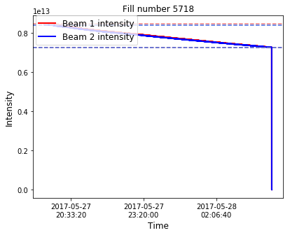


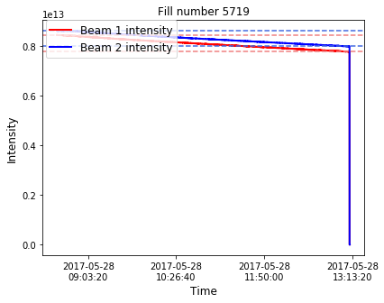


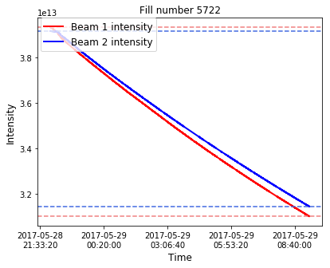


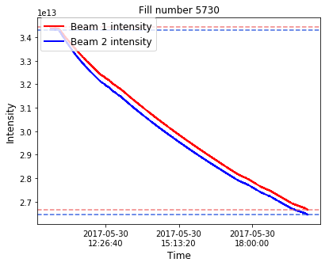


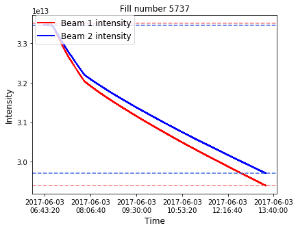


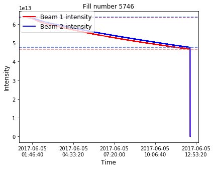


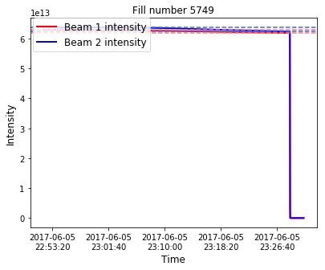


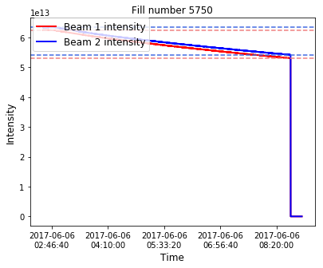


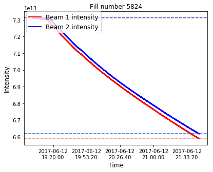


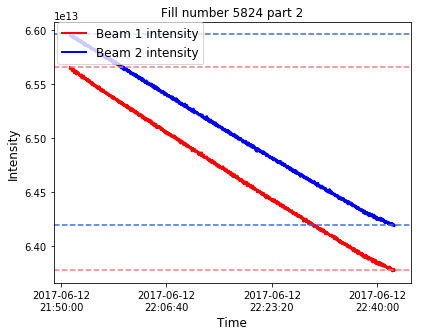


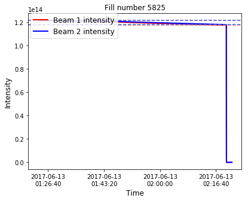


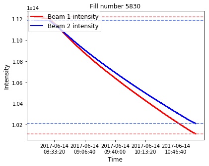


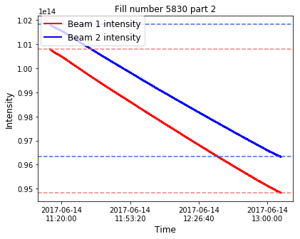


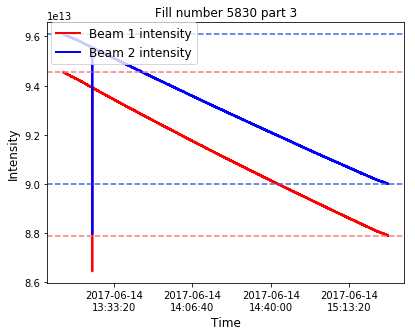


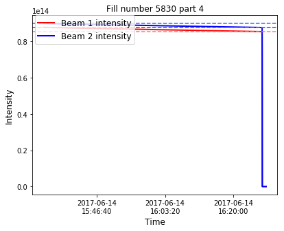


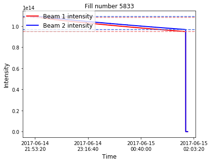


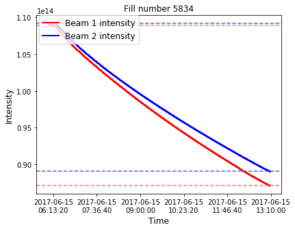


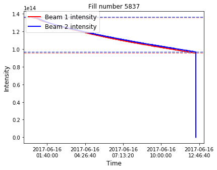


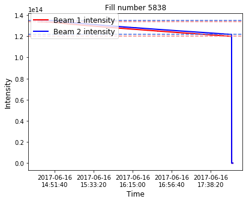


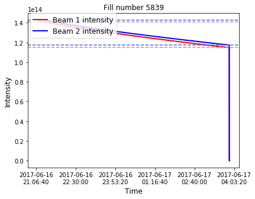


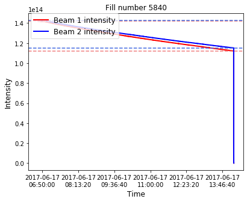


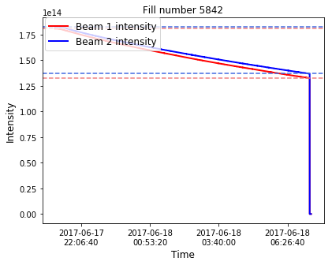


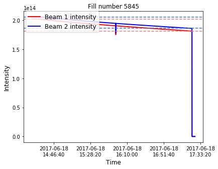


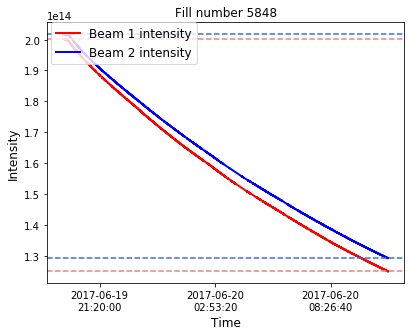


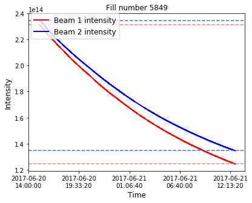


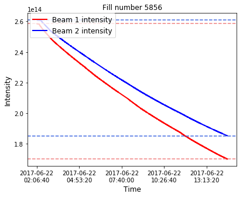


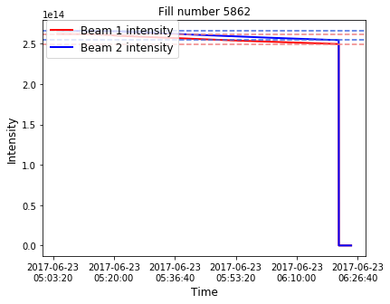


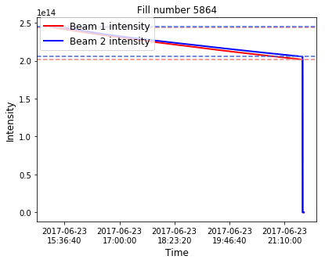


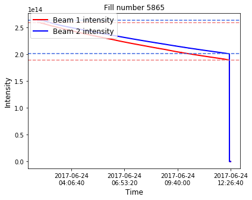


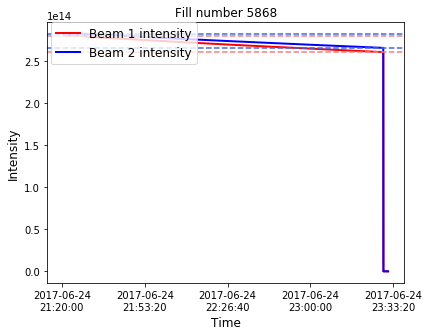


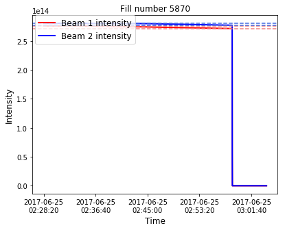


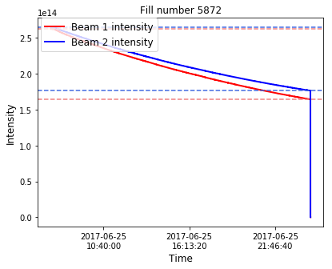


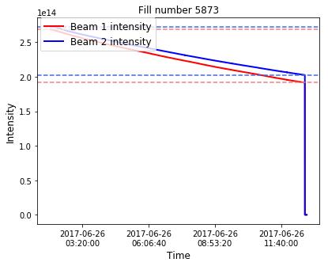


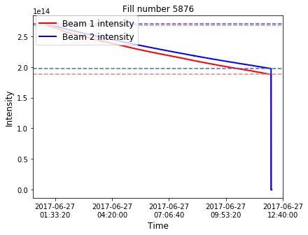


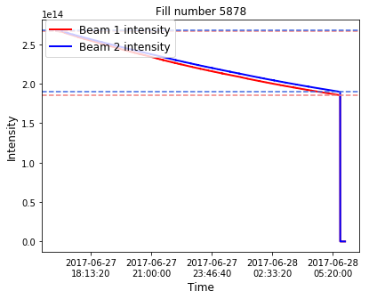


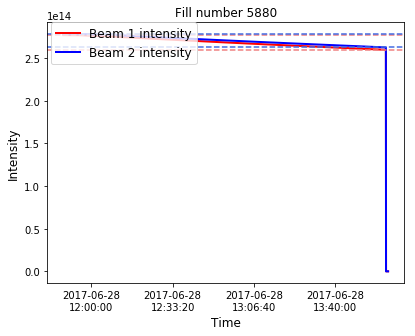


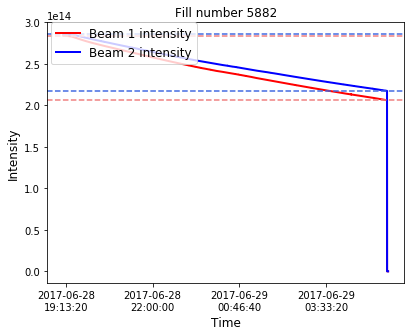


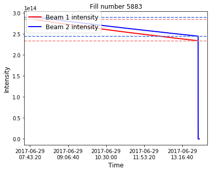


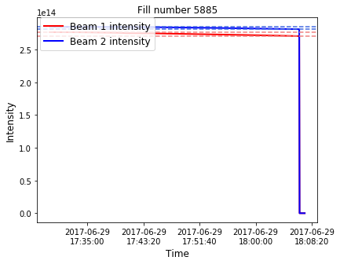


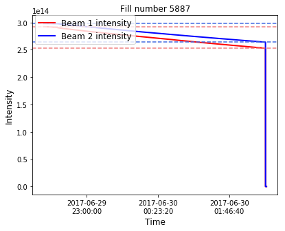


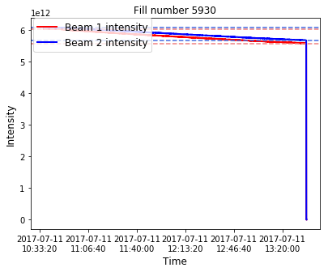


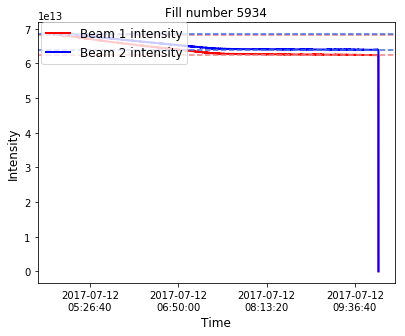


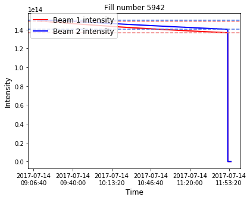


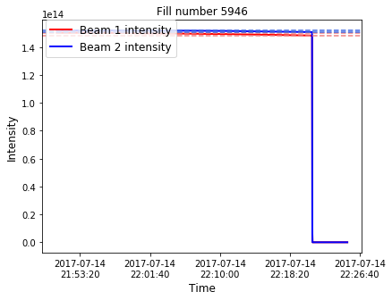


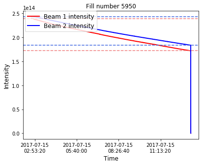


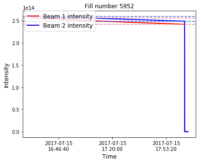


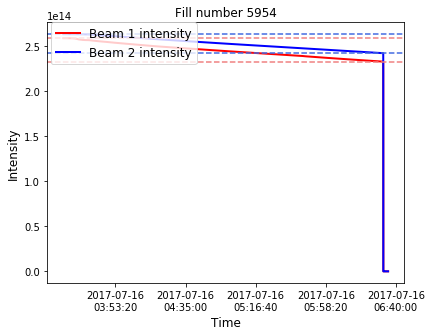


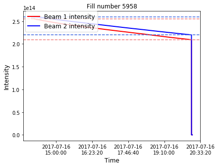


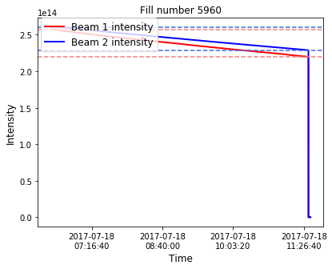


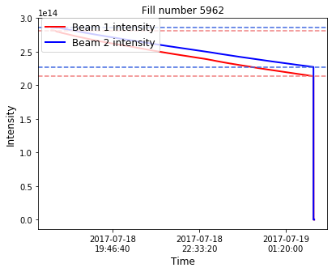


```python
# luminosity burn-off = number of protons lost in LHC collisions for each beam
lumi_burnoff = (50.11+49.96+1.75)*1e15*76*1e-3
print ("Lumi burnoff: " , '{:0.3e}'.format(lumi_burnoff))

# dumped protons = protons extracted from the LHC at the end of each fill
print ("Dumped protons b1: " , '{:0.3e}'.format(lost_b1))
print ("Dumped protons b2: " , '{:0.3e}'.format(lost_b2))
```

    Lumi burnoff:  7.738e+15
    Dumped protons b1:  9.745e+15
    Dumped protons b2:  8.652e+15


```python
# Lost protons in collimators and absorbers, calculated as the difference between the total lost protons and the luminosity burn-off

print ("Non-lumi losses b1: " , '{:0.3e}'.format(lost_b1-lumi_burnoff))
print ("Non-lumi losses b2: " , '{:0.3e}'.format(lost_b2-lumi_burnoff))
print ("Non-lumi losses b1+b2: " , '{:0.3e}'.format(lost_b1+lost_b2-2*lumi_burnoff))
```

    Non-lumi losses b1:  2.007e+15
    Non-lumi losses b2:  9.139e+14
    Non-lumi losses b1+b2:  2.921e+15


```python

```
